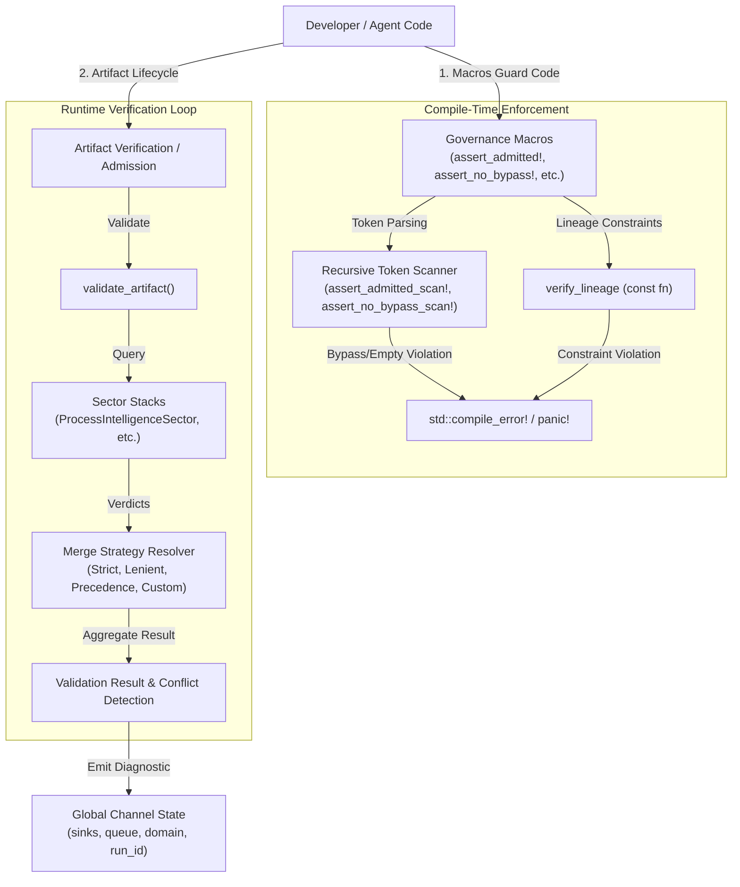

# Project: Chicago TDD Tools - Governance Refactoring

## Architecture
The Refactored Governance sub-system reduces duplicate verification logic between compile-time const checking and runtime validation, dries up macro definitions, and clarifies data flows.

## Milestones
| # | Name | Scope | Dependencies | Status |
|---|------|-------|-------------|--------|
| 1 | Exploration & Analysis | Investigate duplicate logic in `src/core/governance/` and compile-fail tests | None | DONE |
| 2 | Lineage Logic Unification | Unify compile-time and runtime lineage checks into a shared `const fn` in `laws.rs` | M1 | PLANNED |
| 3 | Macro De-duplication | Dry up assertion macros and scan token munching into helper macros/functions | M2 | PLANNED |
| 4 | Visual Documentation | Create `docs/governance_architecture.md` with Mermaid diagrams | M1 | PLANNED |
| 5 | Verification & Testing | Build and run unit tests, compile-fail tests, clippy and formatting checks | M2, M3, M4 | PLANNED |
| 6 | OCEL 2.0 Integration | Implement automatic OCEL generation from test execution and self-teaching loop | M5 | PLANNED |

## Interface Contracts
...
- `on_test_started(name: &str)` - Lifecycle hook for test start.
- `on_test_completed(name: &str, passed: bool)` - Lifecycle hook for test completion.
- `OcelCollector` - DiagnosticSink that produces OCEL 2.0 logs.
- `verify_lineage(nodes: &[LineageNode]) -> Result<(), LineageValidationError>` - Shared validation algorithm.
- `verify_lineage_const(nodes: &[LineageNode]) -> bool` - Panic wrapper for compile-time.
- `verify_lineage_runtime(nodes: &[LineageNode]) -> Result<(), String>` - Diagnostic emitter for runtime.
- `__emit_gov_diag!` - Internal macro to build and emit standard diagnostics.

## Code Layout
- `src/core/governance/laws.rs` - Contains unified verification logic, helpers, and macro-backing validation.
- `src/core/governance/mod.rs` - Macro declarations and token scanning macros.
- `docs/governance_architecture.md` - Design and diagram documentation.
- `tests/governance_tests.rs` - Unit and integration tests.
