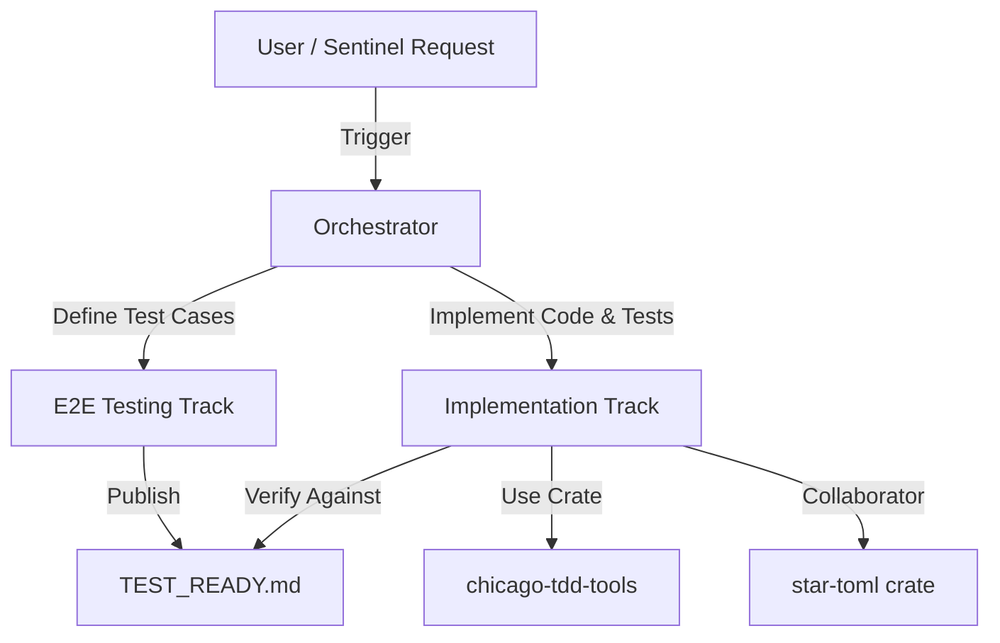

# Project: star-toml Example Implementation

## Architecture
We are implementing the `examples/star-toml/` example using `chicago-tdd-tools`. The example acts as a real-world target testing configuration behavior using real collaborators (`star-toml` crate) rather than mocks.

```mermaid
graph TD
    UserReq["User / Sentinel Request"] -->|Trigger| Orch["Orchestrator"]
    Orch -->|Define Test Cases| E2E["E2E Testing Track"]
    Orch -->|Implement Code & Tests| Impl["Implementation Track"]
    Impl -->|Use Crate| Chicago["chicago-tdd-tools"]
    Impl -->|Collaborator| StarToml["star-toml crate"]
    E2E -->|Publish| TestReady["TEST_READY.md"]
    Impl -->|Verify Against| TestReady
```

## Milestones
| # | Name | Scope | Dependencies | Status |
|---|------|-------|-------------|--------|
| 1 | Setup & Dependency Registry | Add `star-toml` to dev-dependencies; register `star_toml` example target in `Cargo.toml`. | None | DONE |
| 2 | E2E Testing Track | Design and build opaque-box test suite for Tiers 1-4, publish `TEST_READY.md`. | M1 | DONE |
| 3 | Implementation Track | Implement `examples/star-toml/main.rs` & sample config files. Pass all Tiers 1-4 tests. | M2 | DONE |
| 4 | Documentation & Hardening | Create README.md, run adversarial coverage checks (Tier 5), run Forensic Auditor, prepare receipt. | M3 | DONE |

## Interface Contracts
### `star_toml` CLI / Example Target
- Binary name: `star_toml`
- Invocation: `cargo run --example star_toml`
- Expected behavior: Prints structured alerts (success/warning/info) showcasing TOML loading, merging, and validation.
- Exit code: 0 on success, non-zero on failure.

## Code Layout
- `Cargo.toml` - Dev-dependency registry and example registration.
- `examples/star-toml/main.rs` - Main example executable and integrated TDD tests.
- `examples/star-toml/README.md` - Diátaxis documentation.
- `examples/star-toml/samples/` - Sample TOML configuration files.
