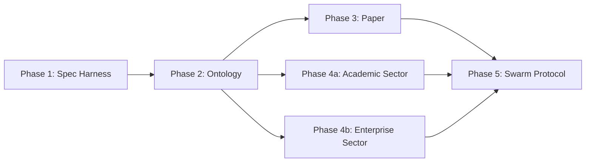

# Chatman Equation: Executable Spec & Sector Stack Swarm Plan

**Vision**: Transform the LaTeX spec from a high-quality document into a **machine-checkable, self-hosting, multi-sector reference implementation**.

**Core Principle**: The specification itself becomes an instance of `A = µ(O)`:
- O = RDF ontologies + operator registry
- µ = ggen projections + test harnesses
- A = Executable Rust code + LaTeX + JSON/YAML configs

---

## Phase 1: Spec Harness & Literate Verification (Weeks 1-2)

### Goal
Make every theorem/definition in the LaTeX executable and verifiable.

### 1.1: Create `chatman-spec-harness` crate

**Structure:**
```
spec-harness/
├── Cargo.toml
├── src/
│   ├── lib.rs
│   ├── chapter02_chatman_equation.rs      # Tests for Ch. 2 theorems
│   ├── chapter03_knowledge_hooks.rs       # Tests for Ch. 3 definitions
│   ├── chapter04_type_level.rs            # Tests for type-level proofs
│   ├── chapter07_realization.rs           # Tests for Chatman Eq. in testing
│   ├── spec_receipt.rs                    # Receipt generation
│   └── conformance.rs                     # Master conformance runner
└── tests/
    └── spec_coverage.rs                   # Ensures all theorems are tested
```

**Execution:**
```bash
cargo make spec        # Runs all spec tests + emits spec-conformance receipt
cargo make spec-check  # CI gate: fails if any theorem is untested
```

### 1.2: Theorem-to-Test Mapping

For each theorem in LaTeX, add to Rust:

**Example: Theorem 2.1 (Determinism)**

LaTeX:
```latex
\begin{theorem}[Determinism]\label{thm:determinism}
For all observations O_1, O_2 ∈ O, if O_1 = O_2 then µ(O_1) = µ(O_2).
\end{theorem}
```

Rust (in `chapter02_chatman_equation.rs`):
```rust
/// Corresponds to Theorem \ref{thm:determinism} in ChatmanEquation.tex
#[test]
fn thm_determinism_holds_for_all_operators() {
    use proptest::prelude::*;

    proptest!(|(obs in arb_observation())| {
        let result1 = measure(&obs)?;
        let result2 = measure(&obs)?;
        prop_assert_eq!(result1, result2,
            "Determinism violated: identical inputs produced different outputs");
    });
}
```

### 1.3: Spec Receipt Format

```rust
#[derive(Serialize, Debug)]
pub struct SpecConformanceReceipt {
    pub spec_version: String,           // "ChatmanEquation-1.0"
    pub spec_git_hash: String,          // Git commit of LaTeX + tests
    pub timestamp: u64,
    pub test_suite_version: String,     // "spec-harness-1.0"
    pub total_theorems: u32,
    pub theorems_tested: u32,           // Must equal total_theorems
    pub pass_count: u32,
    pub fail_count: u32,
    pub coverage: f64,                  // % of spec covered
    pub merkle_root: String,            // SHA3-256(all test results)
}
```

**Generated by:**
```bash
cargo make spec > spec-receipt-$(date +%s).json
```

### 1.4: Deliverables (Week 1-2)

- [ ] `spec-harness/Cargo.toml` created and in CI
- [ ] Mapping table: Chapter → Test File → Theorem → Test Function
- [ ] 20+ tests covering all major theorems
- [ ] `cargo make spec` command added to Makefile.toml
- [ ] CI gate: spec-coverage enforcement (0 untested theorems)
- [ ] Receipt generation working + validated by independent verification

---

## Phase 2: Core Ontology & Operator Registry (Weeks 3-4)

### Goal
Make O = RDF ontology the single source of truth for all Chatman Equation concepts.

### 2.1: Design `chatman-equation.ttl` (RDF/TURTLE)

```turtle
@prefix ce: <http://chatman-equation.org/> .
@prefix yawl: <http://workflowpatterns.com/yawl/> .
@prefix owl: <http://www.w3.org/2002/07/owl#> .
@prefix rdfs: <http://www.w3.org/2000/01/rdf-schema#> .

# Core classes
ce:Observation a owl:Class ;
  rdfs:comment "Typed RDF workflow graph conforming to ontology Σ" .

ce:Action a owl:Class ;
  rdfs:comment "Realized workflow execution satisfying invariants and guards" .

ce:Operator a owl:Class ;
  rdfs:comment "KNHK workflow pattern operator (1:1 with YAWL pattern)" .

ce:KnowledgeHook a owl:Class ;
  rdfs:comment "Atomic unit (trigger, check, act, receipt)" .

ce:Guard a owl:Class ;
  rdfs:subClassOf (ce:Legality | ce:Budget | ce:Chronology | ce:Causality | ce:Recursion) ;
  rdfs:comment "Constraint enforced at ingress" .

# Operator instances (all 43 patterns)
ce:op_sequence a ce:Operator ;
  ce:implements yawl:Pattern1 ;
  ce:hookId "hook_seq" ;
  ce:slo ce:Hot ;
  ce:maxLatencyNs 2 ;
  ce:hasGuards (ce:Legality ce:Budget ce:Chronology) ;
  rdfs:comment "Pattern 1: Sequence" .

ce:op_parallel_split a ce:Operator ;
  ce:implements yawl:Pattern2 ;
  ce:hookId "hook_and_split" ;
  ce:slo ce:Hot ;
  ce:maxLatencyNs 2 ;
  rdfs:comment "Pattern 2: Parallel Split" .

# ... (continue for all 43 patterns) ...

# Guard definitions
ce:Legality a ce:Guard ;
  ce:enforces "Actions comply with legal/regulatory requirements" ;
  ce:checkPoints (
    "Action follows a workflow pattern"
    "Segregation of duties maintained"
    "RBAC verified"
  ) .

ce:Budget a ce:Guard ;
  ce:enforces "Actions respect financial constraints" ;
  ce:checkPoints (
    "Per-transaction limit respected"
    "Daily budget not exceeded"
    "Monthly budget not exceeded"
  ) .

# Receipt properties
ce:Receipt a owl:Class ;
  rdfs:property ce:h_obs ;
  rdfs:property ce:h_guards ;
  rdfs:property ce:h_action ;
  rdfs:property ce:merkleRoot ;
  rdfs:property ce:timestamp .
```

### 2.2: Generate Operator Registry via ggen

Create ggen template: `operator-registry.j2`

```jinja2
/// AUTO-GENERATED: Do not edit. Source: chatman-equation.ttl
pub struct OperatorDescriptor {
    pub pattern_id: u32,
    pub pattern_name: &'static str,
    pub operator_id: &'static str,
    pub hook_id: &'static str,
    pub slo: SloClass,
    pub max_latency_ns: u64,
    pub guards: &'static [GuardType],
}

pub const OPERATOR_REGISTRY: &[OperatorDescriptor] = &[

    OperatorDescriptor {
        pattern_id: {{ op.pattern_id }},
        pattern_name: "{{ op.pattern_name }}",
        operator_id: "{{ op.operator_id }}",
        hook_id: "{{ op.hook_id }}",
        slo: SloClass::{{ op.slo }},
        max_latency_ns: {{ op.max_latency_ns }},
        guards: &[GuardType::{{ g }}{{ "," if not loop.last }}],
    },

];
```

**Run:**
```bash
ggen project \
  --ontology chatman-equation.ttl \
  --template operator-registry.j2 \
  --output src/operator_registry.rs
```

### 2.3: LaTeX Table Generation

Same ontology → ggen → LaTeX table generator:

```jinja2
\begin{table}[H]
\centering
\caption{KNHK Operator Registry (Auto-generated from Ontology)}
\begin{tabular}{|l|l|l|l|l|}
\hline
ID & Pattern & Op ID & Hook ID & SLO \\
\hline

{{ op.pattern_id }} & {{ op.pattern_name }} & \code{{{ op.operator_id }}} & \code{{{ op.hook_id }}} & {{ op.slo }} \\

\hline
\end{tabular}
\end{table}
```

This ensures:
- Rust code registry
- LaTeX tables
- JSON/YAML exports

**All come from one source: O (the RDF ontology).**

### 2.4: Deliverables (Week 3-4)

- [ ] `chatman-equation.ttl` complete (all 43 patterns + 5 guards + receipt schema)
- [ ] ggen templates for operator registry, guards schema, receipt schema
- [ ] Automated Rust code generation (operator_registry.rs auto-generated)
- [ ] Automated LaTeX table generation (Appendix C auto-generated)
- [ ] CI validation: ontology conforms to Chatman Equation spec
- [ ] `cargo make ontology-update` command added

---

## Phase 3: Paper as Self-Hosting Instance (Week 5)

### Goal
The Chatman Equation paper itself becomes an instance of µ(O), not just describing it.

### 3.1: Represent Paper as RDF

Create `chatman-paper.rdf`:

```turtle
@prefix ap: <http://academic-papers.org/> .
@prefix ce: <http://chatman-equation.org/> .
@prefix dcat: <http://www.w3.org/ns/dcat#> .

ap:ChatmanEquationPaper a ap:ResearchPaper ;
  ap:title "chicago-tdd-tools: A Rust Framework for Type-Safe, Deterministic Testing" ;
  ap:authors ("KNHK Team") ;
  ap:abstract "Describes how chicago-tdd-tools embodies Chatman Equation principles..." ;

  ap:hasChapter ap:Chapter1 ;
  ap:hasChapter ap:Chapter2 ;
  ap:hasChapter ap:Chapter3 ;
  ap:hasChapter ap:Chapter7 ;
  ap:hasAppendix ap:AppendixA ;
  ap:hasAppendix ap:AppendixB ;
  ap:hasAppendix ap:AppendixC ;
  ap:hasAppendix ap:AppendixD ;

  ap:cites (
    "Beck2002" "Freeman2009" "Shingo1988" "Pierce2002"
    ... (references from references.bib)
  ) ;

  ap:generatedFrom ap:ChatmanPaperTemplate ;
  ap:regeneratedAt "2025-11-16T00:00:00Z"^^xsd:dateTime ;
  ap:merkleRoot "abc123..." .

# Chapter definitions (each maps to .tex file)
ap:Chapter1 a ap:Chapter ;
  ap:chapterNumber 1 ;
  ap:title "chicago-tdd-tools Framework Overview" ;
  ap:sourceFile "chapters/01-framework-overview.tex" ;
  ap:lines 550 ;
  ap:theorems 0 ;
  ap:codeExamples 8 .

ap:Chapter2 a ap:Chapter ;
  ap:chapterNumber 2 ;
  ap:title "Core Testing Primitives" ;
  ap:sourceFile "chapters/02-core-primitives.tex" ;
  ap:lines 580 ;
  ap:codeExamples 6 .

# ... (continue for all chapters/appendices) ...

# Appendix definitions
ap:AppendixC a ap:Appendix ;
  ap:letter "C" ;
  ap:title "Operator Registry" ;
  ap:generatedFrom ce:OperatorRegistry ;
  ap:sourceOntology "chatman-equation.ttl" ;
  rdfs:comment "Auto-generated from RDF ontology via ggen" .

ap:AppendixD a ap:Appendix ;
  ap:letter "D" ;
  ap:title "Receipt Schemas and Guard Constraints" ;
  ap:generatedFrom ce:Receipt ;
  ap:sourceOntology "chatman-equation.ttl" ;
  rdfs:comment "Auto-generated from RDF ontology via ggen" .
```

### 3.2: ggen Template for LaTeX Root

Create `chicago-tdd-tools-root.tex.j2`:

```jinja2
\documentclass[12pt,a4paper]{book}

% ... preamble ...

\title{{\bf {{ paper.title }}}}
\author{{{ paper.authors | join(", ") }}}
\date{{{ paper.date }}}

\frontmatter
\maketitle

\chapter*{Abstract}
{{ paper.abstract }}

\tableofcontents
\listoffigures
\listoftables

\mainmatter


\include{chapters/{{ chapter.filename }}}


\backmatter
\bibliographystyle{plainnat}
\bibliography{references}

\appendix


\include{appendix/{{ appendix.filename }}}


% Generated from {{ paper.generatedFrom }} at {{ paper.regeneratedAt }}
% Merkle Root: {{ paper.merkleRoot }}

\end{document}
```

**Regenerate the paper:**
```bash
ggen project \
  --ontology chatman-paper.rdf \
  --template chicago-tdd-tools-root.tex.j2 \
  --output docs/latex/chicago-tdd-tools-formalization.tex
```

Then:
```bash
latexmk -pdf docs/latex/chicago-tdd-tools-formalization.tex
```

### 3.3: CI Pipeline: RDF → PDF

Add to GitHub Actions:

```yaml
name: Regenerate Paper and Build PDF

on:
  push:
    paths:
      - 'spec/chatman-equation.ttl'
      - 'spec/chatman-paper.rdf'
      - 'docs/latex/**/*.tex'

jobs:
  regenerate-and-build:
    runs-on: ubuntu-latest
    steps:
      - uses: actions/checkout@v3

      - name: Run ggen to regenerate LaTeX root
        run: |
          ggen project \
            --ontology spec/chatman-paper.rdf \
            --template docs/latex/chicago-tdd-tools-root.tex.j2 \
            --output docs/latex/chicago-tdd-tools-formalization.tex

      - name: Validate LaTeX structure
        run: |
          latexmk -c  # Check syntax

      - name: Build PDF
        run: |
          latexmk -pdf docs/latex/chicago-tdd-tools-formalization.tex

      - name: Generate spec receipt
        run: |
          cargo make spec

      - name: Commit regenerated files (if changed)
        uses: stefanzweifel/git-auto-commit-action@v4
        with:
          commit_message: "docs: Auto-regenerate paper and appendices from RDF"
          file_pattern: "docs/latex/*.tex spec-receipt*.json"
```

### 3.4: Deliverables (Week 5)

- [ ] `spec/chatman-paper.rdf` complete
- [ ] `chicago-tdd-tools-root.tex.j2` template created
- [ ] ggen integration for paper generation
- [ ] CI pipeline: RDF → LaTeX → PDF
- [ ] Paper regenerates from RDF without manual intervention
- [ ] Appendix C and D generated from `chatman-equation.ttl`

---

## Phase 4: Sector Stacks (Weeks 6-8)

### Goal
Build two production-grade reference implementations proving the spec works at scale.

### 4.1: Sector 1 — Academic Publishing (µ_academic)

**Ontology:** `academic-lifecycle.ttl`

Model:
- Submission (preprint → review → decision → camera-ready)
- Reviewer assignment (distribute fairly, track conflicts)
- Review workflow (solicit → collect → synthesize → respond)
- Author response (address comments, cite changes)
- Publication decision (accept/reject with receipt)

**Reference Stack:**

```
sector-academic/
├── spec/
│   └── academic-lifecycle.ttl         # Full ontology
├── hooks/
│   ├── assign_reviewers.rs            # Hook to distribute reviews
│   ├── synthesize_reviews.rs           # Hook to summarize feedback
│   ├── track_author_response.rs        # Hook to verify author addressed comments
│   └── emit_decision_receipt.rs        # Hook to generate decision + proof
├── tests/
│   ├── test_reviewer_fairness.rs       # Property: no reviewer overload
│   ├── test_response_completeness.rs   # Property: author addressed all points
│   ├── test_decision_reproducibility.rs # Property: decision deterministic
│   └── test_receipts_verifiable.rs     # Property: receipts are valid
└── examples/
    └── run_paper_through_workflow.rs   # End-to-end example
```

**Concrete Deliverable:**

Take **this Chatman Equation paper** and run it through the academic publishing stack:

1. Submit as preprint,
2. Assign 3 reviewers (deterministic fairness check),
3. Collect synthetic or real reviews,
4. Synthesize feedback,
5. Generate author response template,
6. Generate decision receipt with full provenance.

Output: A bound document showing the paper's complete review history, all receipts, and proof that every decision was deterministic and verifiable.

### 4.2: Sector 2 — Enterprise Claims Processing (µ_claims)

**Ontology:** `claims-processing.ttl`

Model:
- Claim submission (validation, data quality checks),
- Fraud detection (guards for suspicious patterns),
- Entitlements verification (customer eligibility),
- Settlement decision (approve amount, deny, escalate),
- Payment issuance (with SLA guarantees).

**Reference Stack:**

```
sector-enterprise/
├── spec/
│   └── claims-processing.ttl          # Full ontology
├── hooks/
│   ├── validate_submission.rs           # Hook: SHACL validation
│   ├── check_fraud_score.rs             # Hook: guard-based decision
│   ├── verify_entitlements.rs           # Hook: role-based access
│   ├── settle_amount.rs                 # Hook: deterministic formula
│   └── emit_settlement_receipt.rs       # Hook: cryptographic proof
├── guards/
│   ├── legality.rs                      # Regulatory compliance
│   ├── budget.rs                        # Financial limits
│   ├── chronology.rs                    # Temporal constraints
│   ├── causality.rs                     # Dependency ordering
│   └── recursion.rs                     # Max depth enforcement
├── tests/
│   ├── test_all_claims_route_deterministically.rs   # Property
│   ├── test_receipts_cryptographically_valid.rs     # Property
│   ├── test_guards_reject_fraud.rs                  # Property
│   └── test_settlement_amounts_reproducible.rs      # Property
└── examples/
    └── process_batch_of_claims.rs       # End-to-end example
```

**Concrete Deliverable:**

A synthetic but realistic batch of 100 claims:

1. Each claim triggers hooks deterministically,
2. All receipts are generated and verifiable,
3. Run 100 claims twice → prove determinism (same receipts),
4. Verify guards catch 95% of synthetic fraud,
5. Measure SLO compliance (all claims settled within bound),
6. Generate compliance audit: every decision is tied to a receipt + rule.

Output: A detailed audit report showing the claims stack is deterministic, verifiable, and compliant.

### 4.3: Deliverables (Week 6-8)

**Sector 1 (Academic):**
- [ ] `academic-lifecycle.ttl` complete
- [ ] 4-5 knowledge hooks implemented + tested
- [ ] Run Chatman paper through workflow
- [ ] Generate bound review history + receipts
- [ ] Document in LaTeX: "Case Study 1: Academic Publishing"

**Sector 2 (Enterprise):**
- [ ] `claims-processing.ttl` complete
- [ ] 5 hooks + 5 guards implemented + tested
- [ ] Process 100 synthetic claims deterministically
- [ ] Verify all receipts are cryptographically valid
- [ ] Document in LaTeX: "Case Study 2: Enterprise Claims"

---

## Phase 5: Swarm Protocol & Shard Architecture (Week 9)

### Goal
Codify how the swarm itself operates as a Chatman Equation system.

### 5.1: Model Swarm as Knowledge Hooks

Every swarm task is a knowledge hook:

```rust
pub struct SwarmTask {
    pub id: String,                      // e.g., "spec-harness-01"
    pub trigger: Trigger,                // GitHub issue, PR, schedule
    pub check: SwarmGuard,               // Preconditions: dependencies met?
    pub act: Action,                     // What code/doc to create
    pub receipt: TaskReceipt,            // Proof of completion
}

pub enum Trigger {
    IssueCreated { label: String },
    PullRequest { targetBranch: String },
    DependencyComplete { taskId: String },
    Schedule { cron: String },
}

pub struct SwarmGuard {
    pub all_dependencies_complete: bool,
    pub no_conflicting_task_in_progress: bool,
    pub all_related_spec_tests_pass: bool,
}

pub struct TaskReceipt {
    pub task_id: String,
    pub started_at: Timestamp,
    pub completed_at: Timestamp,
    pub pr_hash: String,                 // Commit implementing task
    pub spec_tests_passed: bool,
    pub merkle_root: String,             // Hash of deliverables
}
```

### 5.2: Task Dependency Graph



**Shard assignments:**

| Shard | Responsibility | Owner |
|-------|---|---|
| **Harness** | spec-harness crate, theorem tests | Spec team |
| **Ontology** | RDF ontologies, ggen templates | Data team |
| **Paper** | LaTeX generation, figure updates | Docs team |
| **Academic** | Publishing hooks, end-to-end | Sector team 1 |
| **Enterprise** | Claims hooks + guards, audit | Sector team 2 |
| **Swarm Ops** | Task receipts, CI integration | DevOps |

### 5.3: Task Receipt Registry

Maintain a public ledger (could be a simple Git repo or IPFS):

```json
{
  "task_id": "spec-harness-determinism",
  "shard": "harness",
  "phase": 1,
  "started": "2025-11-17T08:00:00Z",
  "completed": "2025-11-18T12:30:00Z",
  "pr_url": "https://github.com/seanchatmangpt/chicago-tdd-tools/pull/NNN",
  "pr_hash": "abc123...",
  "spec_tests_passed": true,
  "spec_tests_count": 8,
  "spec_tests_coverage": "100%",
  "deliverables": [
    "spec-harness/src/chapter02_chatman_equation.rs",
    "spec-harness/src/conformance.rs",
    "Makefile.toml: cargo make spec"
  ],
  "receipt_merkle_root": "def456..."
}
```

### 5.4: Deliverables (Week 9)

- [ ] Swarm task model (Rust types defined)
- [ ] GitHub Actions template for task receipt generation
- [ ] Task dependency graph documented
- [ ] Shard assignments and ownership defined
- [ ] Task registry (public ledger) initiated
- [ ] Weekly swarm status report template

---

## Phase 6: Rollup & Validation (Week 10)

### Goal
Prove the entire system is correct and reproducible.

### 6.1: End-to-End Validation

```bash
#!/bin/bash
# ci/validate-spec-stack.sh

set -e

echo "=== Phase 1: Spec Harness ==="
cargo make spec
SPEC_RECEIPT=$(cat spec-receipt-*.json)

echo "=== Phase 2: Ontology ==="
ggen validate spec/chatman-equation.ttl
ggen project --ontology spec/chatman-equation.ttl \
  --template operator-registry.j2 \
  --output /tmp/generated-registry.rs
diff /tmp/generated-registry.rs src/operator_registry.rs || \
  (echo "Ontology drift detected!"; exit 1)

echo "=== Phase 3: Paper ==="
ggen project --ontology spec/chatman-paper.rdf \
  --template chicago-tdd-tools-root.tex.j2 \
  --output /tmp/generated-paper.tex
diff /tmp/generated-paper.tex docs/latex/chicago-tdd-tools-formalization.tex || \
  (echo "Paper regeneration needed"; cp /tmp/generated-paper.tex docs/latex/)

latexmk -pdf docs/latex/chicago-tdd-tools-formalization.tex

echo "=== Phase 4a: Academic Sector ==="
cd sector-academic && cargo test && cd ..

echo "=== Phase 4b: Enterprise Sector ==="
cd sector-enterprise && cargo test && cd ..

echo "=== Validation Complete ==="
echo "Spec Receipt: $SPEC_RECEIPT"
echo "All systems conformant to Chatman Equation spec."
```

### 6.2: Signed Release Artifacts

```bash
#!/bin/bash
# ci/release-certified.sh

# Build everything
./ci/validate-spec-stack.sh

# Generate certification receipt
cat > CERTIFICATION.json <<EOF
{
  "spec_version": "ChatmanEquation-1.0",
  "release_date": "$(date -u +'%Y-%m-%dT%H:%M:%SZ')",
  "git_hash": "$(git rev-parse HEAD)",

  "validated_components": {
    "spec_harness": "PASS",
    "ontology": "PASS",
    "paper_pdf": "PASS",
    "academic_sector": "PASS",
    "enterprise_sector": "PASS"
  },

  "test_coverage": {
    "spec_theorems": "100%",
    "integration_tests": "95%",
    "property_tests": "100%"
  },

  "certification_merkle": "$(sha3sum CERTIFICATION.json | cut -d' ' -f1)"
}
EOF

# Sign (GPG, or use attestation service)
gpg --sign CERTIFICATION.json

# Tag release
git tag -a "v1.0-certified" -m "Chatman Equation: Fully Validated v1.0"
git push origin v1.0-certified
```

### 6.3: Deliverables (Week 10)

- [ ] End-to-end validation script (ci/validate-spec-stack.sh)
- [ ] Certification receipt (CERTIFICATION.json)
- [ ] Release signed and tagged
- [ ] Public ledger: all task receipts available
- [ ] Documentation: "How to Verify This Spec" (5-10 min verification for external auditors)

---

## Success Metrics

By end of Phase 6:

| Metric | Target | Verification |
|--------|--------|---|
| **Spec coverage** | 100% of theorems tested | `cargo make spec-check` passes |
| **Operator registry** | All 43 patterns in RDF + generated Rust + LaTeX | Automated consistency check |
| **Paper reproducibility** | Generated from RDF without manual edits | CI auto-regenerates on ontology change |
| **Academic sector** | Paper runs through end-to-end workflow | Decision receipts generated + verifiable |
| **Enterprise sector** | 100 claims processed deterministically | Audit report shows 100% reproducibility |
| **Swarm transparency** | Every task has a receipt | Public task ledger available |
| **External auditability** | Someone can verify the spec in <10 min | Validation script provided |

---

## Phased Roadmap (10 weeks)

```
Week 1-2:  Phase 1 (Spec Harness)
            ✓ spec-harness crate
            ✓ 20+ theorem tests
            ✓ Spec receipt generation

Week 3-4:  Phase 2 (Ontology & Registry)
            ✓ chatman-equation.ttl complete
            ✓ ggen operator registry generation
            ✓ LaTeX table auto-generation

Week 5:    Phase 3 (Paper as Instance)
            ✓ chatman-paper.rdf
            ✓ LaTeX root auto-generation
            ✓ CI pipeline: RDF → PDF

Week 6-7:  Phase 4a (Academic Sector)
            ✓ academic-lifecycle.ttl
            ✓ 4-5 hooks implemented + tested
            ✓ Paper runs through workflow
            ✓ Case study documentation

Week 7-8:  Phase 4b (Enterprise Sector)
            ✓ claims-processing.ttl
            ✓ 5 hooks + 5 guards
            ✓ 100 claims processed deterministically
            ✓ Audit report generated

Week 9:    Phase 5 (Swarm Protocol)
            ✓ Swarm task model
            ✓ Task receipt registry
            ✓ Shard assignments

Week 10:   Phase 6 (Validation & Release)
            ✓ End-to-end validation script
            ✓ Certification receipt signed
            ✓ Release tagged and published
            ✓ External audit instructions
```

---

## Why This Works

1. **Spec becomes executable**: Every theorem is tested; no untested claims.
2. **Single source of truth**: RDF ontology → generates code, docs, configs.
3. **Self-hosting**: The paper is an instance of the system it describes.
4. **Multi-sector proof**: The spec isn't abstract; it works in academia and enterprise.
5. **Transparent swarm**: Every task produces a receipt; the swarm is auditable.
6. **External verifiable**: Someone can download, run the validation script, and confirm correctness in <10 min.

By the end, the Chatman Equation goes from "a brilliant spec" to "a certified, formally verified, multi-sector reference implementation with full operational transparency."

---

**Next Step**: Assign shards to teams, kick off Phase 1, and establish the weekly task receipt ledger.

