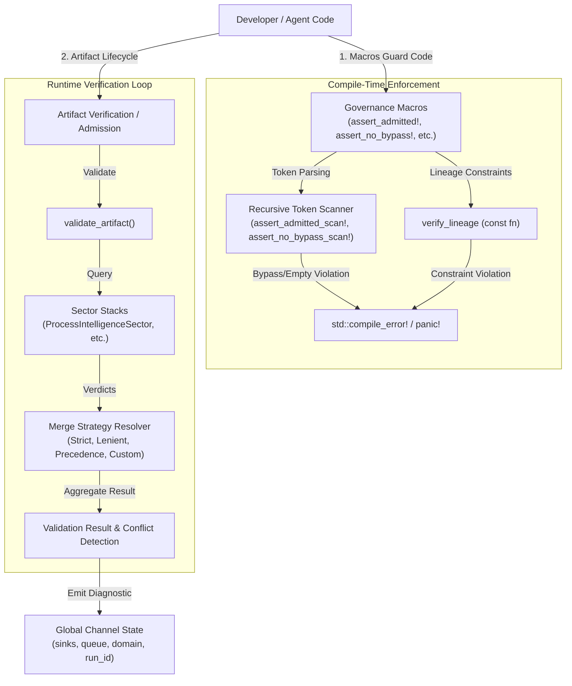
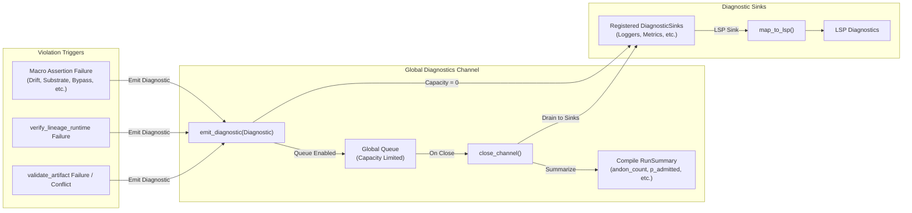

# Agent Governance Architecture

This document describes the design and flow of the agent governance sub-system in Chicago TDD Tools. It details how laws are enforced at compile-time and runtime, and how diagnostics are routed through the global channel to various sinks.

## 1. Governance Loop Architecture

The governance loop verifies that code modifications, metadata, and runtime execution conform to safety and regulatory laws. It operates in two phases:
1. **Compile-Time Static Verification**: Scans token streams for forbidden constructs and validates lineage history using a `const fn`.
2. **Runtime Execution Verification**: Monitors artifact admission, sector validation stacks, and merge strategies during runtime execution.

## 2. Diagnostic Data Flow

Diagnostics are generated from macro checks, lineage failures, or schema validation conflicts. They are emitted to the global diagnostics channel which applies thread-safe synchronization, capacity limits, and routes the reports to registered sinks.

