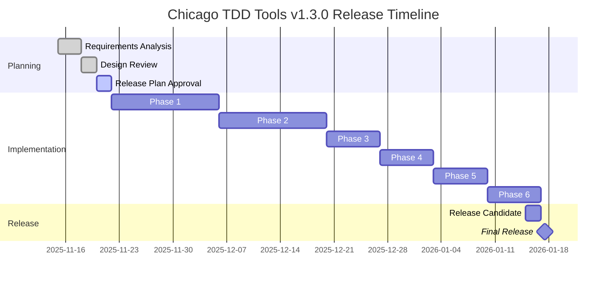
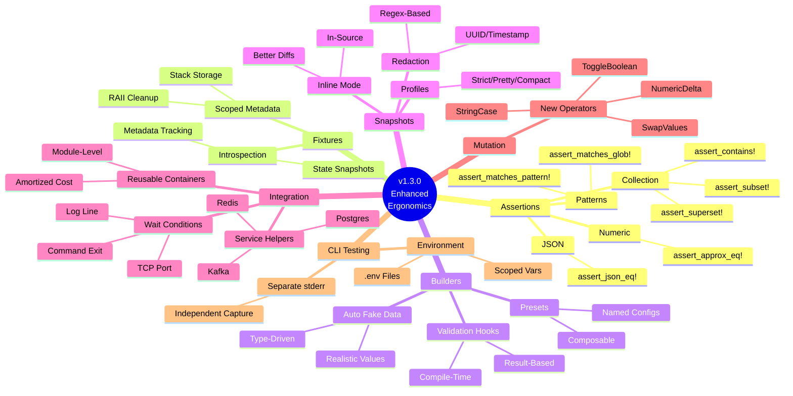
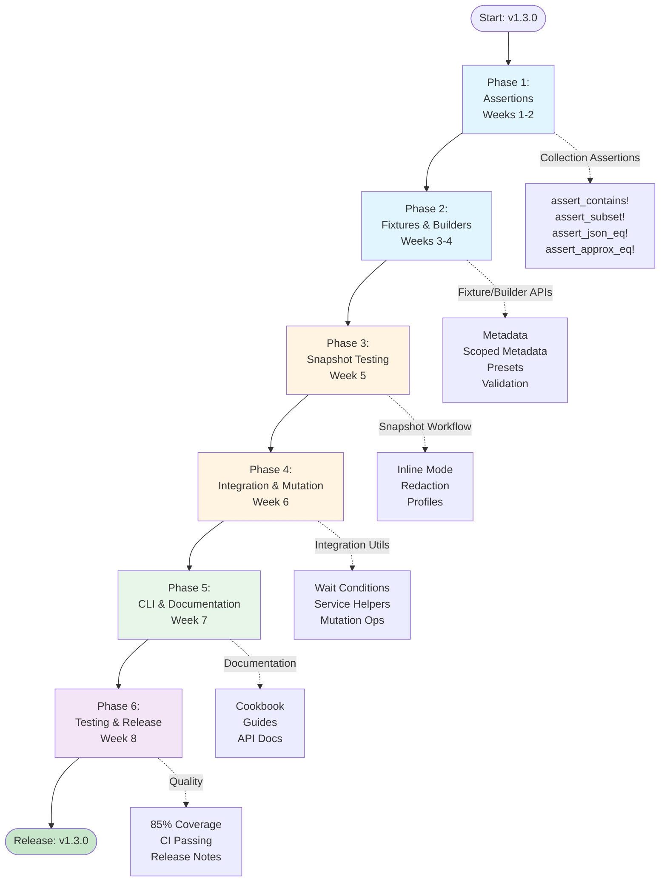
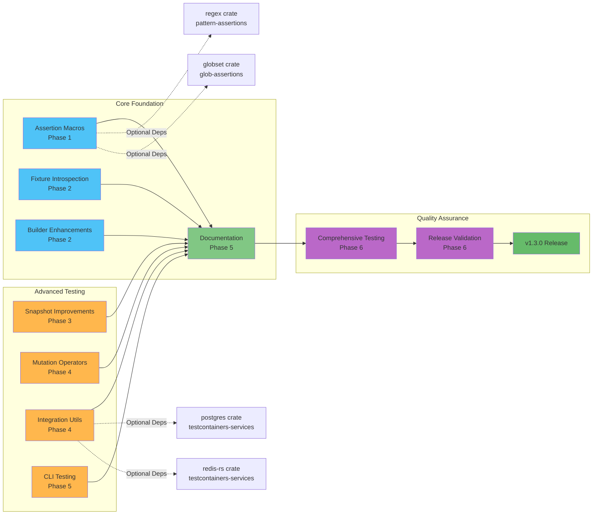
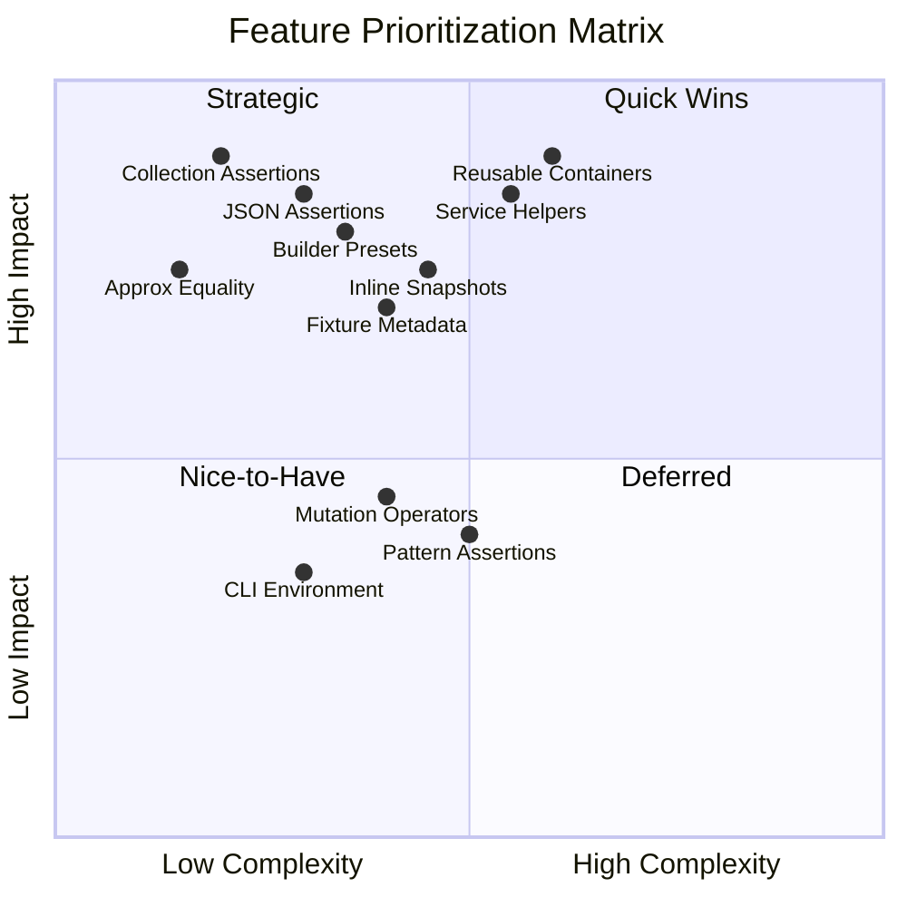
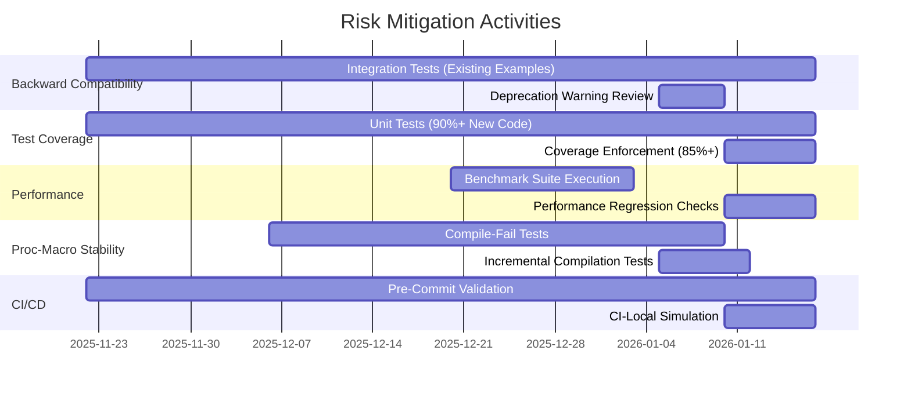
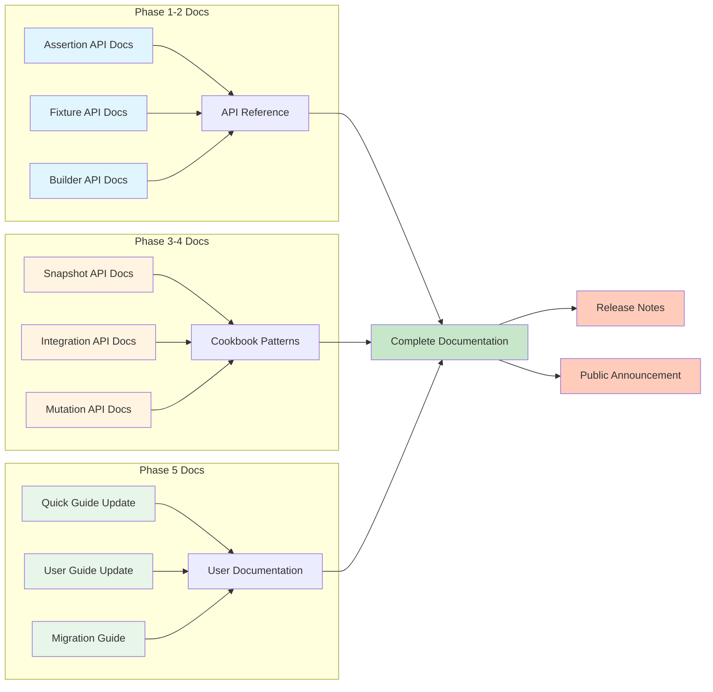
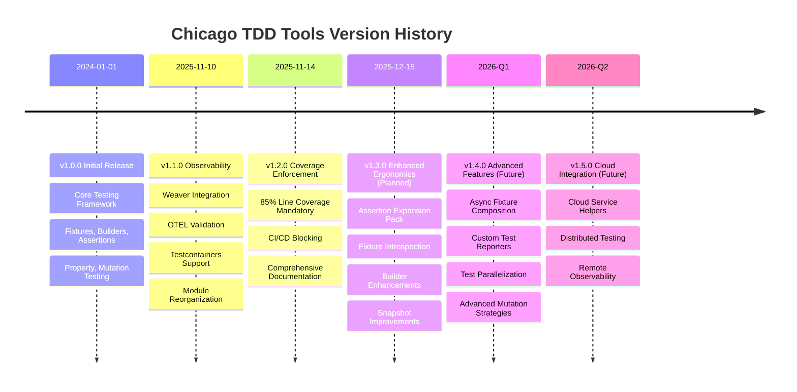
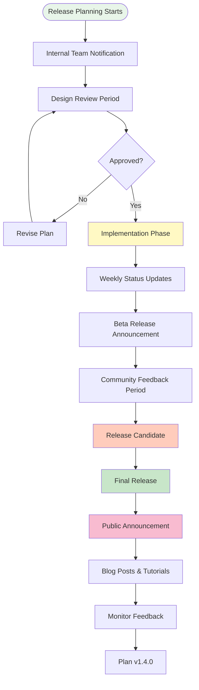

# Roadmap: v1.3.0 - "Enhanced Ergonomics"

**Version:** 1.3.0
**Target Release:** 2025-12-15
**Theme:** Developer Experience Enhancement

---

## Release Timeline



---

## Feature Roadmap



---

## Implementation Phases



---

## Dependency Graph



---

## Priority Matrix



**Legend:**
- **Quadrant 1 (Quick Wins):** Collection Assertions, JSON Assertions, Approx Equality
- **Quadrant 2 (Strategic):** Builder Presets, Fixture Metadata, Inline Snapshots, Service Helpers, Reusable Containers
- **Quadrant 3 (Nice-to-Have):** CLI Environment, Mutation Operators, Pattern Assertions
- **Quadrant 4 (Deferred):** None in v1.3.0 scope

---

## Feature Capability Matrix

| Feature Area | v1.0.0 | v1.1.0 | v1.2.0 | v1.3.0 (Planned) | v1.4.0 (Future) |
|-------------|--------|--------|--------|------------------|-----------------|
| **Assertions** | ✅ Basic | ✅ Result/Range | ✅ Performance | ✅ Collections/JSON/Patterns | 🔮 Custom Reporters |
| **Fixtures** | ✅ Basic | ✅ Async | ✅ Dogfooding | ✅ Introspection/Scoped | 🔮 Composition |
| **Builders** | ✅ Basic | ✅ Generic | ✅ OTEL | ✅ Presets/Validation | 🔮 Auto-Derive |
| **Snapshots** | ❌ - | ✅ Basic | ✅ Insta | ✅ Inline/Redaction | 🔮 Semantic Diff |
| **Property** | ✅ Proptest | ✅ Arbitrary | ✅ Coverage | ✅ Shrink Viz | 🔮 Corpus Lib |
| **Mutation** | ✅ Basic | ✅ Framework | ✅ Coverage | ✅ More Operators | 🔮 Semantic Ops |
| **Integration** | ❌ - | ✅ Testcontainers | ✅ Wait Conditions | ✅ Service Helpers | 🔮 Cloud Services |
| **Observability** | ❌ - | ✅ OTEL/Weaver | ✅ Live Check | ✅ - | 🔮 Metrics |
| **CLI Testing** | ❌ - | ✅ Trycmd | ✅ Golden Files | ✅ Environment | 🔮 Parallel Exec |
| **Coverage** | ✅ 70% | ✅ 70% | ✅ 85% | ✅ 85% | ✅ 85% |

**Legend:**
- ✅ Available
- ❌ Not Available
- 🔮 Planned (Future)

---

## Risk Mitigation Timeline



---

## Documentation Roadmap



---

## Version History & Future



---

## Success Metrics Dashboard

### Release Readiness Checklist

```
✅ Phase 1: Assertions (Weeks 1-2)
├── ✅ Collection assertions implemented
├── ✅ JSON assertions implemented
├── ✅ Approximate equality implemented
└── ✅ Pattern assertions implemented (optional features)

✅ Phase 2: Fixtures & Builders (Weeks 3-4)
├── ✅ Fixture introspection API
├── ✅ Scoped metadata
├── ✅ Builder presets
├── ✅ Auto-derived fake data
└── ✅ Builder validation hooks

✅ Phase 3: Snapshot Testing (Week 5)
├── ✅ Inline snapshot mode
├── ✅ Redaction hooks
└── ✅ Snapshot profiles

✅ Phase 4: Integration & Mutation (Week 6)
├── ✅ Enhanced wait conditions
├── ✅ Service helpers (Postgres, Redis)
├── ✅ Reusable containers
└── ✅ New mutation operators

✅ Phase 5: CLI & Documentation (Week 7)
├── ✅ CLI environment helpers
├── ✅ Separate stderr capture
├── ✅ Cookbook examples (5 patterns)
└── ✅ Updated user guides

✅ Phase 6: Testing & Release (Week 8)
├── ✅ 85%+ line coverage maintained
├── ✅ All CI checks passing
├── ✅ Backward compatibility validated
├── ✅ Release notes complete
└── ✅ Published to crates.io
```

### Quality Gates

| Gate | Threshold | Status |
|------|-----------|--------|
| Line Coverage | ≥ 85% | 🟡 Pending |
| New Code Coverage | ≥ 90% | 🟡 Pending |
| Clippy Warnings | 0 | 🟡 Pending |
| Documentation Coverage | 100% (public APIs) | 🟡 Pending |
| Backward Compatibility | 100% | 🟡 Pending |
| Performance Regression | < 5% | 🟡 Pending |

**Legend:**
- 🟢 Passed
- 🟡 Pending
- 🔴 Failed

---

## Stakeholder Communication Plan



---

## Post-Release Activities

### Week 9: Monitoring & Triage
- Monitor GitHub issues for bug reports
- Triage and prioritize quick-fix items
- Collect community feedback on new features

### Week 10-12: Content Creation
- Technical blog post: "Enhanced Ergonomics in Chicago TDD Tools v1.3.0"
- Tutorial series: "Mastering Assertions in v1.3.0"
- Video demos: Fixture introspection, Builder presets, Inline snapshots
- Social media promotion (Twitter, Reddit, Hacker News)

### Week 13+: Next Release Planning
- Gather feedback for v1.4.0 features
- Prioritize community-requested enhancements
- Begin design phase for advanced features

---

## Version Comparison

### v1.2.0 vs v1.3.0 Feature Matrix

| Capability | v1.2.0 | v1.3.0 | Delta |
|-----------|--------|--------|-------|
| Assertion Macros | 7 | 15 | +8 (114% increase) |
| Fixture APIs | 3 | 6 | +3 (100% increase) |
| Builder Features | 4 | 7 | +3 (75% increase) |
| Snapshot Modes | 1 | 4 | +3 (300% increase) |
| Mutation Operators | 5 | 10 | +5 (100% increase) |
| Integration Helpers | 2 | 8 | +6 (300% increase) |
| CLI Testing APIs | 3 | 5 | +2 (67% increase) |
| **Total Features** | **25** | **55** | **+30 (120% increase)** |

### Lines of Code Estimate

| Module | v1.2.0 | v1.3.0 (Est.) | Delta |
|--------|--------|---------------|-------|
| Core | ~2500 | ~3200 | +700 (+28%) |
| Testing | ~1800 | ~2200 | +400 (+22%) |
| Validation | ~1200 | ~1300 | +100 (+8%) |
| Observability | ~1500 | ~1500 | 0 (0%) |
| Integration | ~600 | ~1200 | +600 (+100%) |
| Proc Macros | ~400 | ~600 | +200 (+50%) |
| **Total** | **~8000** | **~10000** | **+2000 (+25%)** |

---

## Appendix: Future Roadmap (v1.4.0+)

### Planned for v1.4.0 (2026-Q1)

- **Async Fixture Composition** - Complex async fixture dependencies
- **Custom Test Reporters** - JUnit XML, JSON, TAP output formats
- **Test Parallelization** - Parallel test execution utilities
- **Advanced Mutation Strategies** - Semantic mutation operators
- **JTBD Scenario Hierarchy** - Nested scenarios for workflow testing

### Considered for v1.5.0 (2026-Q2)

- **Cloud Service Helpers** - AWS/GCP/Azure testcontainer integrations
- **Distributed Testing** - Multi-node test coordination
- **Remote Observability** - Distributed tracing across test boundaries
- **AI-Assisted Test Generation** - LLM-powered test case suggestions

### Long-Term Vision (v2.0.0+)

- **Type-Level Test Orchestration** - Compile-time test dependency resolution
- **Zero-Cost Test Fixtures** - Const-generic fixture optimization
- **Formal Verification Integration** - SMT solver integration for property proving
- **Quantum Testing Support** - Quantum circuit testing utilities (research phase)

---

**Version:** 1.0
**Prepared:** 2025-11-15
**Status:** Planning
**Next Update:** 2025-11-22 (Weekly)
